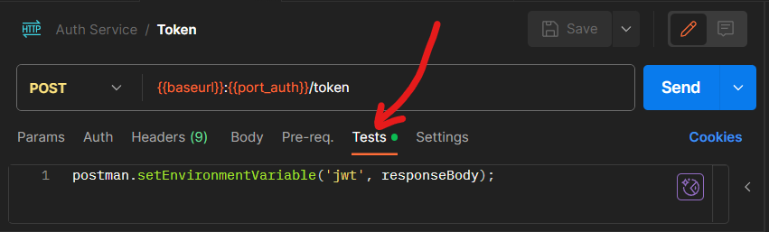
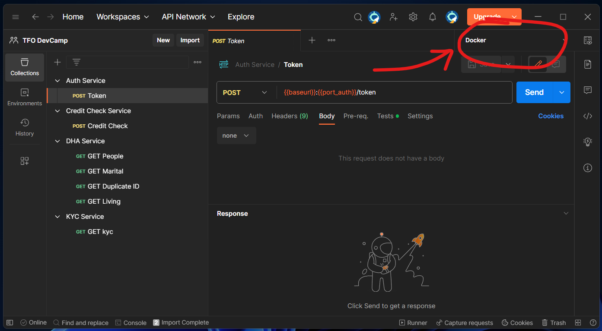

# DevCamp Services

## Table of contents

- [Summary](#summary)
- [Quickstart](#quickstart)
- [Prerequisites](#prerequisites)
- [Interacting with the services](#interacting-with-the-services)
  - [Auth Service](#auth-service)
  - [KYC Service](#kyc-service)
  - [DHA Service](#dha-service)
  - [Credit Check Service](#credit-check-service)
  - [Customer Information Store Service](#customer-information-store-service)
  - [Postgres Database](#postgres-database)
- [Postman Collections](#postman-collections)
- [SoapUI](#soapui)

## Summary

There are five services available for consumption as part of the DevCamp practical exercise.

- **Auth:** REST web service to obtain JWT tokens for auth with other services
- **KYC:** REST web service to obtain KYC (Know Your Customer) information for customers
- **DHA:** REST web service to obtain DHA (Dept. of Home Affairs) information for customers
- **Credit Check:** SOAP web service to perform a credit check for customers
- **Customer Information Store Service:** REST web service for maintaining customer information

## Quickstart

The services are built from local source and orchestrated via [Docker Compose](compose.yaml). Two of the services (KYC, DHA) require an RSA public key for JWT validation, passed in as the `PUB_KEY` environment variable.

Linux shell:
```bash
export PUB_KEY=$(cat app.pub) && docker compose up --build
```

PowerShell:
```PowerShell
$env:PUB_KEY = Get-Content app.pub; docker compose up --build
```

This will build all five services and start them alongside a PostgreSQL database. Once running:

| Service | URL |
|---------|-----|
| Auth | http://localhost:8080 |
| KYC | http://localhost:8081 |
| DHA | http://localhost:8082 |
| Credit Check | http://localhost:8083 |
| CIS | http://localhost:8084 |
| PostgreSQL | localhost:5432 |

## Prerequisites

### Docker

You will need a local installation of Docker (with Compose V2) or an alternative containerization platform. See the [Docker for Windows](https://holocrons.entelect.co.za/code/local-development/docker-for-windows) holocron for information on alternatives to Docker Desktop.

### Postman

It is not a requirement to have Postman installed but it would be beneficial as there are a few Postman collections available that could help you understand how to interact with the services. See the [Postman Collections](#postman-collections) section further down.

There is also a SoapUI project available for testing calls to the SOAP webservice (see the [SoapUI](#soapui) section further down), but the same endpoint is also available in the Postman collections.

## Interacting with the services

### Auth Service

The Auth service can be accessed at http://localhost:8080 and exposes a single endpoint:

- [POST] `/token`

The service requires Basic Auth, making use of a username and password.

This should be used internally in the product/fulfillment service for making requests to third party services. No additional user details are to be stored here — you will need to manage customer credentials on your end.

There are 2 users currently configured in the DB:

1. `admin@entelect.co.za` / `password`
2. `products@entelect.co.za` / `SpringProducts01$`

The `admin@entelect.co.za` account can be used for your system-to-system communication.

The service responds to a successful request to the `/token` endpoint with a JWT in the response body. This JWT can be used for subsequent calls to the [KYC](#kyc-service), [DHA](#dha-service), and [CIS](#customer-information-store-service) services.

The returned JWT is valid only for an hour, after which time a new JWT will have to be obtained from the Auth service.

### KYC Service

The KYC service can be accessed at http://localhost:8081 and exposes a single endpoint:

- [GET] `/kyc/{customerId}`

The service requires a Bearer token in the Authorization header. The bearer token must be a JWT obtained from the Auth service.

The service is documented in the accompanying [OpenAPI document](kyc.yaml) or at http://localhost:8081/swagger/index.html when the service is running.

### DHA Service

The DHA service can be accessed at http://localhost:8082 and exposes four endpoints:

- [GET] `/status/people`
- [GET] `/status/marital/{idNumber}`
- [GET] `/status/duplicateId/{idNumber}`
- [GET] `/status/living/{idNumber}`

The service requires a Bearer token in the Authorization header. The bearer token must be a JWT obtained from the Auth service.

The service is documented in the accompanying [OpenAPI document](dha.yaml) or at http://localhost:8082/swagger/index.html when the service is running.

### Credit Check Service

The Credit Check service can be accessed at http://localhost:8083 and exposes a single endpoint:

- `/CreditCheck`

The service requires Basic Auth, making use of a username and password.

The service is documented in the accompanying [WSDL document](creditcheck.wsdl).

### Customer Information Store Service

The customer information store can be accessed on http://localhost:8084 and exposes 13 endpoints for maintaining customer information:

- [GET] `/v1/customers`
- [GET] `/v1/customer/{customer_id}`
- [POST] `/v1/customer/`
- [GET] `/v1/customer/`
- [GET] `/v1/customerTypes`
- [POST] `/v1/customerTypes`
- [PUT] `/v1/customer/{customerId}/customerTypes/{customerTypeId}`
- [GET] `/v1/customer/{customerId}/documents`
- [GET] `/v1/customer/{customerId}/documents/{documentId}`
- [POST] `/v1/customer/{customerId}/documents`
- [GET] `/v1/accountTypes`
- [POST] `/v1/accountTypes`
- [POST] `/v1/customer/{customerId}/accounts/{accountTypeId}`

This service requires a Bearer Token in JWT format to be able to be accessed.

The service is documented in the accompanying [OpenAPI document](customer-information.yaml).

### Postgres Database

There is a PostgreSQL database deployed along with the services. You can use this database to store information for the services that you build.

If you are running your services in the Docker environment, you can use the Docker container name as the hostname for the database:

```yaml
spring:
  datasource:
    url: jdbc:postgresql://DevCamp-Postgres-db:5432/postgres
    username: user
    password: password
    driverClassName: org.postgresql.Driver
```

If you add the container to the docker compose file, it will be able to access the network by default. If you want to run the docker image separately, you will need to specify the network:

```bash
docker run --network devcamp-starter_default -p 8084:8080 devcamp-cis-service:latest
```

If you are running your application locally (i.e. IntelliJ, mvnw or java run) then you would need to specify the db hostname as localhost. It is recommended to use Spring profiles — one for running the service locally and another for running via Docker.

## Postman Collections

In the [/Postman](Postman/) folder of this repository, there are five collections that can be imported into your Postman workspace:

- [Auth Service.postman_collection.json](Postman/Auth%20Service.postman_collection.json)
- [KYC Service.postman_collection.json](Postman/KYC%20Service.postman_collection.json)
- [DHA Service.postman_collection.json](Postman/DHA%20Service.postman_collection.json)
- [Credit Check Service.postman_collection.json](Postman/Credit%20Check%20Service.postman_collection.json)
- [Customer Information Store.postman_collection.json](Postman/)

Additionally there is also an environment that can be imported into your workspace:

- [Docker.postman_environment.json](Docker.postman_environment.json)

These collections and environment will enable you to test all five of the services if they are running through Docker Compose.

It is worth pointing out that the `POST Token` request in the `Auth Service` collection includes a Test Script which automatically writes the returned JWT into the `{{jwt}}` variable of the active environment. This means that you do not have to manually copy and paste the JWT in order to test the KYC Service and DHA Service.



Finally, it is also important to note that the Postman environment imported above needs to be selected as the active environment in the top right corner of Postman in order for the variables defined in it to take effect.



## SoapUI

In the [/SoapUI](SoapUI/) folder of this repository, there is a [SoapUI project file](SoapUI/creditcheck-soapui-project.xml) which includes some test SOAP API calls to the Credit Check Service.
